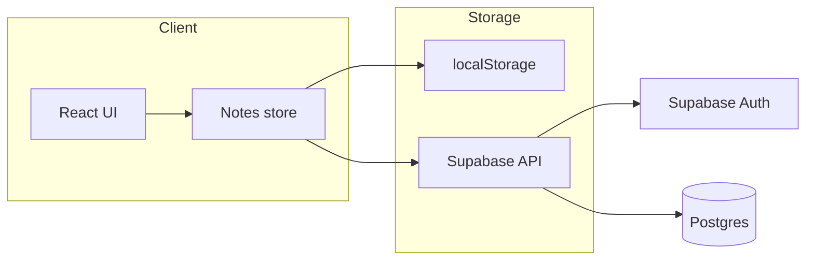

# blob — Tap-to-create notes web app (v1)

- **App name:** "blob" (lowercase everywhere: title, branding, storage keys).

## Summary of choices

- **Stack:** Next.js (React), Supabase (Auth + Postgres).
- **Persistence:** Anonymous → localStorage only. After Google login → notes stored in Supabase and synced; first-time login **merges** local and cloud notes.
- **React setup:** Next.js.

---

## Data model

- **Note:** `id`, `x`, `y` (position), `content` (rich text or markdown for bullets), `createdAt`, `updatedAt`. Optional `userId` once synced.
- **Storage:** One blob of state per user: e.g. `{ notes: Note[] }`. Store in localStorage under a key like `blob_notes_anonymous` and in Supabase in a single row per user (e.g. `user_notes` table: `user_id`, `data jsonb`, `updated_at`).
- **Preferences:** Theme (light/dark), character color scheme (e.g. `"pink"` default), and any other UI prefs. Stored in browser (localStorage) and, when logged in, synced to cloud (e.g. same `user_notes` row or a dedicated `user_preferences` / `data.preferences` in the same blob). All preferences are loaded on app run and persisted on change.

---

## Architecture

- One **global notes store** (e.g. React Context + reducer, or Zustand): list of notes, add/update/delete/reorder, set position.
- **Persistence layer:** abstract over "source of truth" — either localStorage or Supabase. On load: if no user, read from localStorage; if user, fetch from Supabase and optionally merge with localStorage on first load after login.
- **Auth:** Supabase Google OAuth; protect only the "sync" path (no need to gate the app for anonymous use).

---

## Implementation plan

### 1. Next.js app and base UI

- Create Next.js app (App Router), add basic layout and a full-screen canvas area (e.g. `min-height: 100vh`) where taps create notes. App title/branding: "blob" (lowercase).
- **App graphics:** Use the graphics in the `**assets/`** directory. Source image `assets/blob.png` and generated `assets/icons/` (e.g. `assets/icons/web/` for favicon and PWA icons: 16, 32, 180, 192, 512). Expose these via Next.js `public/` (e.g. copy or symlink at build, or reference from `public`). Use blob branding and any hamburger/account assets from `assets/` in the header and app chrome. Character assets: `**assets/character color schemes.png`** (grid image for character color chooser) and `**assets/character expressions/`** (e.g. `pink.png` — grid of expressions per color).
- **Mobile:** Layout and interactions must work well on mobile: responsive viewport, touch-friendly tap targets, no hover-only UI. Full-screen canvas and header scale appropriately; notes remain tappable and draggable.
- **Header chrome (fixed or sticky):**
  - **Upper left:** Hamburger menu icon. Tapping opens a slide-out or dropdown that shows:
    - **Version:** single auto-incremented version number (e.g. in package.json or a small version.json / build-time env; read and display in UI).
    - **Build date and time:** generated at build time, displayed in the **user's timezone** (e.g. new Date(buildTimestamp).toLocaleString() or Intl).
    - **Theme switcher:** toggle between light and dark; persist choice (see Preferences below).
    - **Character chooser:** Use `**assets/character color schemes.png`** as the graphic for a grid-based selector (each cell = one color scheme). All character grids are **3×3**. User taps a cell to set the current character color; default is pink. Selection is persisted with other preferences.
  - **Upper right:** Account bubble (avatar).
    - **Before login:** show a "?" inside a circular bubble. Tapping opens the account flow: options for "Login" and "Create account" (both lead to Google OAuth; "Create account" is the same sign-in, Supabase creates the account on first Google sign-in).
    - **After login:** show user avatar (e.g. Google profile image) in the bubble; tapping can show sign-out or account details later.
- No auth required to use the app; the account bubble is the only entry point for login/create account.
- **Bottom center — character:** Show the current character graphic in the bottom center of the app screen. Use the selected color scheme (default: pink) and the current expression from the expression grid. Character is non-interactive (decorative); selection is changed only via the hamburger character chooser.
- **Character expressions:** Use the grid image for the current color (e.g. `**assets/character expressions/pink.png`**). All grids are **3×3**. The visible expression is one cell from that grid. Occasionally change the expression based on user action (e.g. after creating/editing a note) or inaction (e.g. idle for a period). Keep logic simple (e.g. cycle or random cell on a timer or event).

### 2. Notes state and tap-to-create

- Define a **notes store** (e.g. Context + useReducer or Zustand): state = `notes: Note[]` with actions: `addNote(x, y)`, `updateNote(id, payload)`, `deleteNote(id)`, `setNotePosition(id, x, y)`.
- **Tap to create:** on click/tap on the canvas (not on an existing note), create a note at `(clientX, clientY)` with default content (e.g. "• ") and focus the note for typing.
- **Bulleted list:** each note is an editable block (e.g. `contentEditable` div or a small editor) that supports bullets (e.g. "• " at line start, or simple markdown "- "). Keep implementation minimal (e.g. Enter => new line with "• ", support paste).

### 3. Drag and edit

- **Drag:** make each note draggable (e.g. drag handle or whole card). On drag end, call `setNotePosition(id, x, y)` so the store updates and persistence can run.
- **Edit:** click note to focus and type; blur or explicit "done" to commit. All edits go through `updateNote(id, { content })`.

### 4. Persistence (localStorage and preferences)

- **Anonymous:** on every change to `notes`, serialize and write to `localStorage` (e.g. key `blob_notes_anonymous`). On app load, read from localStorage and hydrate the store.
- **Preferences:** Save all preferences (theme, character color scheme, etc.) to localStorage (e.g. key `blob_preferences`). When logged in, sync preferences to cloud (e.g. include in user data blob or separate table) and retrieve on app run so prefs persist across devices.
- Debounce or throttle writes to avoid excessive I/O.

### 5. Supabase project and auth

- Create Supabase project, enable Google provider in Auth settings, add redirect URL for the app.
- In the app: Supabase client (e.g. `@supabase/supabase-js`), env vars `NEXT_PUBLIC_SUPABASE_URL` and `NEXT_PUBLIC_SUPABASE_ANON_KEY`.
- Implement "Sign in with Google" (redirect or popup) and "Sign out"; store session and show user in header.

### 6. Supabase schema and sync

- **Table:** e.g. `user_notes (user_id uuid primary key, data jsonb not null, updated_at timestamptz)`.
- **Sync up:** when user is logged in, on note changes (debounced), upsert `user_notes` with `data = { notes }` and current `updated_at`.
- **Sync down:** on login or on focus/interval, fetch `user_notes` for the user. If this is **first time** after login (e.g. flag from merge), **merge** local notes with cloud notes (e.g. by id, newer `updatedAt` wins, then append cloud-only notes). After merge, write merged list back to Supabase and to localStorage so state is consistent.
- **First-time merge:** persist a small flag in localStorage (e.g. `blob_merged_<userId>`) so you only run the merge once per user; subsequent loads just use cloud data.

### 7. Polish

- Ensure tap target is the canvas only (not notes) for "create note"; hit-test so clicks on notes don't create a new one.
- Basic styling: note cards readable and draggable; list bullets clear; layout responsive and touch-friendly on mobile.
- Error handling: toast or inline message if Supabase sync fails; keep local state and retry.

---

## File structure (suggested)

- `app/page.tsx` — full-screen canvas + notes render; tap handler; header with hamburger (top-left) and account bubble (top-right).
- `app/layout.tsx` — root layout, theme provider (light/dark), Supabase session provider if needed.
- `components/Header.tsx` (or inline in page) — hamburger menu (version, build date/time in user TZ, theme switcher, character chooser using `assets/character color schemes.png` grid) and account bubble (? before login; avatar after; tap opens Login / Create account flow).
- `components/Character.tsx` (or inline) — bottom-center character: render current color scheme and expression from `assets/character expressions/<color>.png` grid; expression updates on user action or idle.
- `components/NoteCard.tsx` — single note: contentEditable area, drag handle, position.
- `lib/notes-store.ts` (or `store/notes.ts`) — state + actions for notes.
- `lib/persistence.ts` — localStorage read/write; Supabase read/write; merge logic.
- `lib/supabase.ts` — Supabase client; optional server client for RLS.
- `hooks/useNotes.ts` — consume notes store and persistence (load on mount, save on change, sync when logged in).
- `**assets/`** — app graphics: `blob.png` (source), `icons/` (generated by `scripts/generate-icons.js`), `character color schemes.png` (grid for character chooser in hamburger), `character expressions/` (e.g. `pink.png` — expression grid per color). Use for favicon, PWA icons, header, and character UI.

---

## Out of scope for v1

- Real-time multi-device sync (polling or one-way "save" is enough).
- Rich text / formatting beyond bullets.
- Note deletion (can add later; same store + persistence).

---

## Security

- Use Supabase RLS so `user_notes` is readable/writable only by `auth.uid()`.
- Keep `NEXT_PUBLIC_SUPABASE_ANON_KEY` in env; no service role key in the client.
