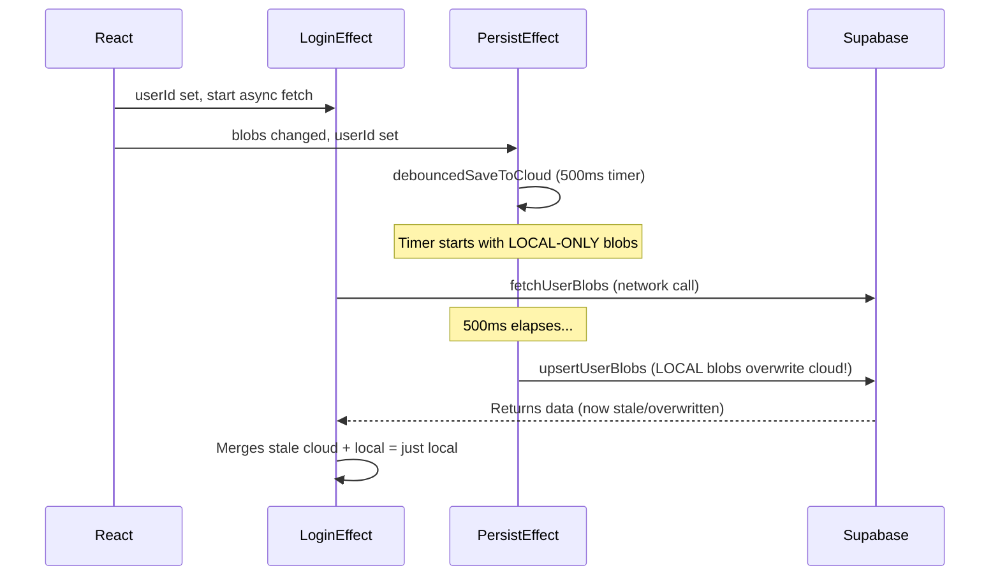

# Fix Cloud Sync Between Browsers

## Root Cause: Race Condition

The persist effect (`[contexts/BlobsContext.tsx](contexts/BlobsContext.tsx)` line 151) races with the login merge effect (line 110). Here is the exact sequence:

1. User opens tab. `userId` becomes set (from localStorage session).
2. React renders with `blobs = [localStorage blobs]`, `userId = "xxx"`, `isLoading = false`.
3. **Both** the login effect (line 110) and the persist effect (line 151) fire in the same render cycle.
4. Login effect starts an async `fetchUserBlobs()` (network call, takes 200-2000ms).
5. Persist effect runs **synchronously** and calls `debouncedSaveToCloud` with **localStorage-only blobs** -- starts a 500ms timer.
6. If the fetch takes longer than 500ms (very likely), the debounced save fires and **overwrites cloud data with stale localStorage blobs** before the login effect ever finishes.
7. Login effect finishes, fetches cloud -- but cloud now has the stale data from step 6. The real cloud data is lost.

## Bug 2: Merged flag prevents cloud push

On line 139, `if (!getMergedFlag(userId))` gates the upsert after merge. Once the flag is set (first-ever login on an origin), the login effect never pushes merged results back to cloud. So data from this origin's localStorage gets merged into memory but never written to the cloud for the other origin to pick up.

## Bug 3: Silent errors

`fetchUserBlobs` returns `null` on any Supabase error (including "table doesn't exist" or RLS denial). `upsertUserBlobs` returns `false` on error. Neither is ever logged. We have no idea if these calls are succeeding.

## Fix

### 1. Add a "syncing" guard to prevent persist effect from saving to cloud during login merge

- Add a `syncingRef = useRef(false)` in the provider
- Set it to `true` at the start of the login merge effect
- Set it to `false` when the login merge effect finishes
- In the persist effect, skip cloud saves when `syncingRef.current === true` (localStorage save is still fine)

### 2. Always push merged result to cloud after login merge

Remove the `getMergedFlag` check gating the upsert on line 139. After every login merge, push the merged blobs to cloud so the other origin can see them.

### 3. Log errors from all Supabase operations

- In `fetchUserBlobs`: log the error before returning null
- In `upsertUserBlobs`: log the error before returning false
- In `debouncedSaveToCloud`: log the result of upsert

### 4. Add more diagnostic logging

- Log in persist effect when cloud save is skipped (syncing) vs executed
- Log in poll when fetch succeeds but data is unchanged

### Files to change

- `[lib/persistence.ts](lib/persistence.ts)`: Add error logging to `fetchUserBlobs` and `upsertUserBlobs`
- `[contexts/BlobsContext.tsx](contexts/BlobsContext.tsx)`: Add syncingRef guard, always push after merge, add logging
