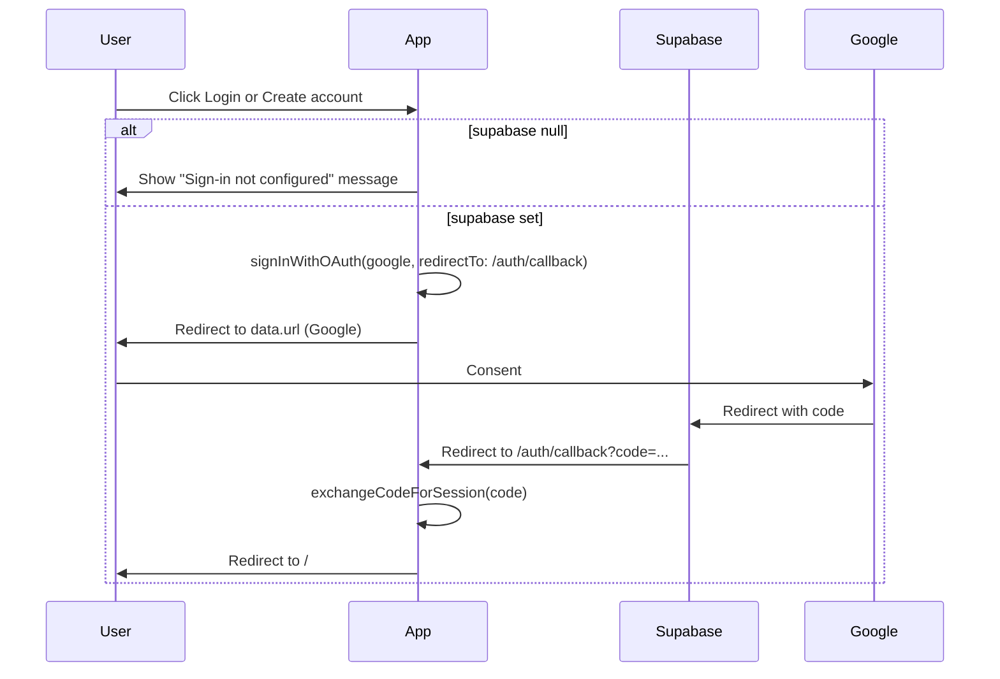

# Fix Login and Create account (Google OAuth)

## Why the buttons do nothing

1. **Supabase client is null**
  In [lib/supabase.ts](lib/supabase.ts), if `NEXT_PUBLIC_SUPABASE_URL` or `NEXT_PUBLIC_SUPABASE_ANON_KEY` are missing (e.g. no `.env.local`), `supabase` is `null`. In [components/Header.tsx](components/Header.tsx), `signIn()` does `if (!supabase) return;` and exits with no user feedback.
2. **No redirect to Google**
  `signInWithOAuth({ provider: "google" })` returns `{ data: { url }, error }`. The app never uses `data.url` to send the user to Google. The call is also not awaited, and there is no `redirectTo` option, so Supabase would not know where to send the user after login.
3. **No auth callback**
  After Google consent, Supabase redirects to a callback URL with a `code`. The app has no `/auth/callback` route to exchange that code for a session, so the user never gets logged in.

---

## Implementation

### 1. Make sign-in redirect and handle missing Supabase

**File: [components/Header.tsx](components/Header.tsx)**

- When **supabase is null**: show a clear message in the account dropdown (e.g. "Sign-in is not configured. Add NEXT_PUBLIC_SUPABASE_URL and NEXT_PUBLIC_SUPABASE_ANON_KEY to .env.local and configure Google in the Supabase dashboard."). Keep Login / Create account visible but on click show this message (or show it inline when the dropdown opens and supabase is null) so the user knows why nothing happens.
- When **supabase is set**:
  - Make `signIn` async.
  - Call `signInWithOAuth` with:
    - `provider: "google"`
    - `options: { redirectTo:` ${window.location.origin}/auth/callback `}` so Supabase redirects back to the app after Google login.
  - Await the result.
  - If `data?.url`: set `window.location.href = data.url` to send the user to Google.
  - If `error`: show a short error (e.g. set local state and render "Sign-in failed: …" in the dropdown or a small toast).

No separate "Create account" flow: both Login and Create account call the same Google OAuth flow; Supabase creates the blob user on first sign-in.

### 2. Add auth callback route

**New file: `app/auth/callback/page.tsx`** (client component)

- Read `code` from the URL (e.g. `useSearchParams().get('code')`).
- If there is no `code`, redirect to `/`.
- If `supabase` is null, redirect to `/`.
- Call `await supabase.auth.exchangeCodeForSession(code)` to create the session (stored in localStorage by the existing client).
- On success: redirect to `/` (e.g. `router.replace('/')` or `window.location.href = '/'`).
- On error: redirect to `/` with an optional query (e.g. `?auth_error=1`) or show a brief "Sign-in failed" message then redirect; keep the page minimal (no full app chrome).

Use a client component so the existing browser Supabase client (localStorage) is used; no server-side Supabase client or cookies required.

### 3. Redirect allow list

**File: [README.md](README.md)** (optional but recommended)

- Under Supabase setup, add a step: in the Supabase dashboard (Authentication → URL Configuration), add `http://localhost:3000/auth/callback` to the redirect allow list for local dev, and the production callback URL for production.

---

## Flow after changes

---

## Files to touch

| File                                           | Change                                                                                        |
| ---------------------------------------------- | --------------------------------------------------------------------------------------------- |
| [components/Header.tsx](components/Header.tsx) | Async signIn, redirectTo, redirect to data.url, error handling, message when supabase is null |
| `app/auth/callback/page.tsx`                   | New client page: read code, exchangeCodeForSession, redirect to /                             |
| [README.md](README.md)                         | Document redirect URL allow list (optional)                                                   |

No changes to [lib/supabase.ts](lib/supabase.ts) or to the NotesContext auth listener; they already work once the session exists.
