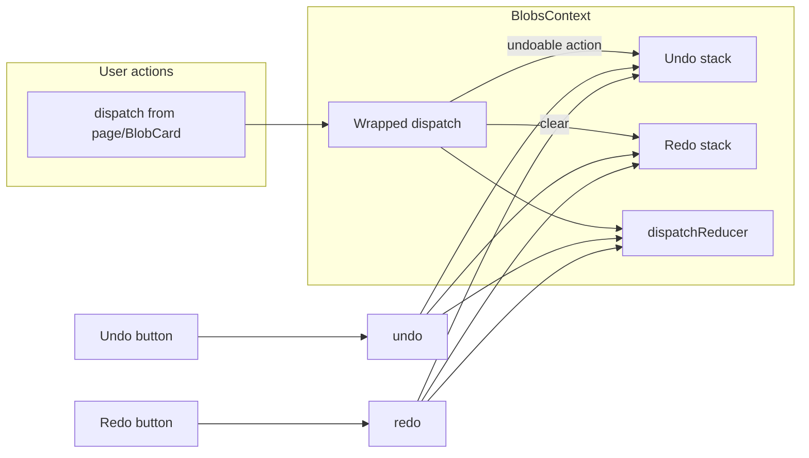

# Full undo and redo

## Scope

- **Undoable state:** Blob list only (add, delete, duplicate, update content, position, lock, hide, unhide all). Preferences (theme, Blobby) are not undone.
- **UI:** Two buttons in the main menu ([Header.tsx](components/Header.tsx)): **Undo** and **Redo**, placed in a new menu section (e.g. above "Unhide all"). Buttons disabled when nothing to undo/redo.
- **Optional later:** Keyboard shortcuts (e.g. Ctrl+Z / Ctrl+Shift+Z) can be added in a follow-up.

## Architecture

- **Snapshot-based history:** Store full `Blob[]` snapshots. On undo: pop from undo stack, apply via `SET_BLOBS`, push current state to redo stack. On redo: pop from redo stack, apply via `SET_BLOBS`, push current state to undo stack. New user action clears the redo stack and may push current state to undo stack.
- **No undo push for:** Initial load, login merge, logout clear, and cloud poll merge (all use `SET_BLOBS` from effects inside the context). Use an internal "raw" dispatch for those and for applying undo/redo so they never push to history.
- **SET_POSITION coalescing:** Position updates fire on every pointer move during drag. To avoid one drag creating dozens of undo steps, push to undo only when the *previous* action was not `SET_POSITION` (i.e. one step per drag). Same pattern already exists for persistence (`lastActionRef`); reuse or mirror that for undo.

## Implementation

### 1. Undo/redo state and logic in [contexts/BlobsContext.tsx](contexts/BlobsContext.tsx)

- **State:** Two stacks (e.g. `undoStack: Blob[][]`, `redoStack: Blob[][]`) with a max size (e.g. 50) to bound memory.
- **Ref:** e.g. `isUndoRedoRef` so that when we apply `SET_BLOBS` from `undo()` or `redo()`, the wrapper does not push to undo/redo.
- **Undoable action set:** All blob-changing actions: `ADD_BLOB`, `DELETE_BLOB`, `DELETE_BLOBS`, `DUPLICATE_BLOB`, `DUPLICATE_BLOBS`, `UPDATE_BLOB`, `SET_POSITION`, `SET_LOCKED`, `SET_HIDDEN`, `UNHIDE_ALL`. Do *not* push for `SET_BLOBS`.
- **Wrapper around dispatch:**
  - If `isUndoRedoRef.current`: call internal reducer only; return.
  - If action is undoable: push current `blobs` (from ref) to undo stack (with coalescing for `SET_POSITION`: only push when previous action type was not `SET_POSITION`), clear redo stack, enforce max undo stack size.
  - Call internal reducer with the action.
- **Functions:** `undo()` and `redo()` as above; expose `canUndo`, `canRedo` (derived from stack lengths).
- **Context value:** Add `undo`, `redo`, `canUndo`, `canRedo` to [BlobsContextValue](contexts/BlobsContext.tsx) (and keep existing `dispatch` as the wrapped one so all call sites automatically go through undo logic).

### 2. Main menu buttons in [components/Header.tsx](components/Header.tsx)

- Use `useBlobsContext()` to read `undo`, `redo`, `canUndo`, `canRedo`.
- Add a new **menu section** (e.g. after Blobby, before "Unhide all") with two buttons:
  - **Undo** — `onClick`: call `undo()`, then `setMenuOpen(false)` (optional, for consistency with "Unlock all"). Disabled when `!canUndo`.
  - **Redo** — same pattern, disabled when `!canRedo`.
- Reuse existing menu styling: `styles.menuSection`, `styles.menuAction` (same as "Unhide all", "Unlock all", "Show all") so the buttons look consistent. No new CSS required unless you want icons (e.g. arrow icons); plan assumes text-only "Undo" and "Redo".

### 3. Edge cases

- **Hydration / load:** Initial `SET_BLOBS` from `loadBlobsFromStorage()` in `useEffect` must use the internal reducer path (no undo push). Same for merge on login, logout clear, and cloud poll.
- **Sync:** When cloud poll merges and dispatches `SET_BLOBS`, do not push to undo (that's system state, not user action).
- **Max stack size:** When pushing to undo, shift oldest entry if stack length would exceed 50 (or chosen limit).

## Files to touch

| File | Change |
|------|--------|
| [contexts/BlobsContext.tsx](contexts/BlobsContext.tsx) | Add undo/redo stacks, ref, wrapped dispatch with coalescing for SET_POSITION, undo(), redo(), canUndo/canRedo; expose in context value. Internal effects and undo/redo call reducer directly. |
| [components/Header.tsx](components/Header.tsx) | New menu section with Undo and Redo buttons; use context for undo, redo, canUndo, canRedo. |

## Testing (manual)

- Add blob, undo → blob removed. Redo → blob back.
- Move blob (drag), undo → position reverted. Redo → position restored.
- Edit content, undo → text reverted.
- Delete, duplicate, lock, hide, unhide all → undo/redo restores or reverts as expected.
- Undo then perform a new action → redo stack clears; undo still goes back correctly.
- Load app, open menu → Undo/Redo disabled when history empty.
