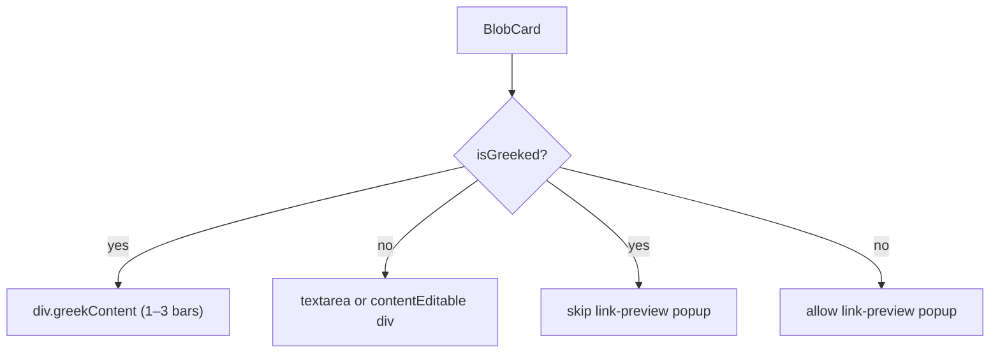

# Greeking Facility

## What "greeking" replaces

At low zoom, two things inside `.card` are expensive and unreadable:

- The `.content` (preview mode) or `.contentRaw` textarea (raw mode) — real DOM text, links, bullets, todo checkboxes.
- The link-preview popup image/card that can appear over a blob.

The resize-edge handles and the controls column (dragger + "…") are intentionally **not** greeked — they remain interactive.

## Threshold logic

The blob's on-screen height is `(effectiveH ?? DEFAULT_BLOB_H) * scale` pixels. Two thresholds (with hysteresis to prevent flicker):

- **Enter greek mode:** on-screen height < `GREEK_ENTER_PX` (proposed: `32px`)
- **Exit greek mode:** on-screen height > `GREEK_EXIT_PX` (proposed: `40px`)

`BlobCard` already receives `scale` as a prop and computes `effectiveH`, so no new props are needed.

## Greek representation

Replace the entire content area with a `<div className={styles.greekContent}>` containing 1–3 horizontal bars. Bar count is derived from the blob's line count (`blob.content` parsed via `isBlobContentEmpty` / line count), capped at 3, so a single-line blob looks visually distinct from a multi-line one.

Each bar is a `<div className={styles.greekBar} />`.

No text, no `contentEditable`, no textarea — just static divs.

## State management

Add a `isGreeked` boolean state to `BlobCard`. A `useEffect` watches `(effectiveH ?? DEFAULT_BLOB_H) * scale` and applies the hysteresis:

```ts
useEffect(() => {
  const screenH = (effectiveH ?? DEFAULT_BLOB_H) * scale;
  setIsGreeked(prev => {
    if (!prev && screenH < GREEK_ENTER_PX) return true;
    if (prev && screenH > GREEK_EXIT_PX) return false;
    return prev;
  });
}, [effectiveH, scale]);
```

## Files to change

- `[components/BlobCard.tsx](components/BlobCard.tsx)` — add `isGreeked` state + effect, conditional render of greek content instead of real content when greeked, suppress link-preview popup when greeked.
- `[components/BlobCard.module.css](components/BlobCard.module.css)` — add `.greekContent`, `.greekBar` styles.

## CSS for greek bars

```css
.greekContent {
  flex: 1;
  min-width: 0;
  padding: 2px 4px 2px 0;
  display: flex;
  flex-direction: column;
  gap: 5px;
  justify-content: center;
}

.greekBar {
  height: 6px;
  border-radius: 3px;
  background: var(--blob-border, rgba(0, 0, 0, 0.12));
}

/* Vary widths to look natural — handled via nth-child */
.greekBar:nth-child(1) { width: 85%; }
.greekBar:nth-child(2) { width: 65%; }
.greekBar:nth-child(3) { width: 75%; }
```

Dark theme variant adds a `[data-theme="dark"] .greekBar` rule with a lighter tint.

## Render logic summary



## Edge cases

- **Focused blob** — if `hasContentFocus` is true when the threshold would trigger greeking, skip the transition (don't greek a blob the user is actively editing). Clear the focus state guard when the blob is blurred.
- **Active resize** — if `resizingEdge` is set, skip the transition similarly.
- **blob.locked** — no special case needed; locked blobs render the same content; they can be greeked normally.
