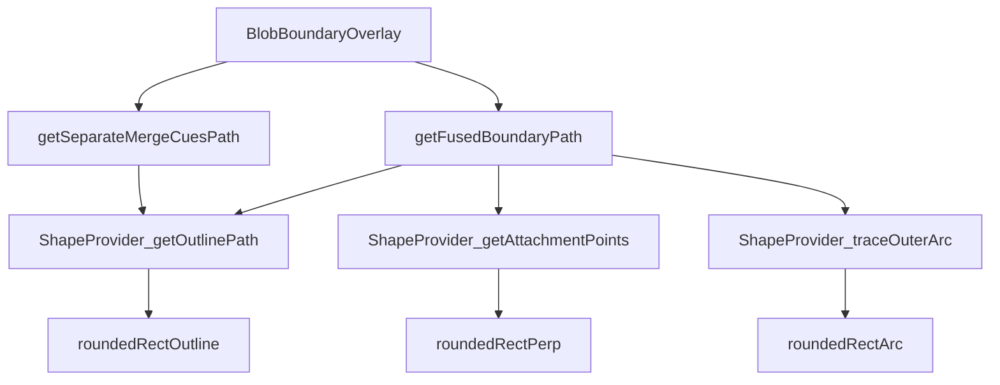

# Merge Cue Outline Fix

## Goal

- Both separate and fused cue outlines follow each blob's exact shape + padding.
- Fused outline works correctly at any angle (horizontal, vertical, diagonal).
- A clean `BlobShapeProvider` function interface makes it easy to add new blob shapes later.

## Architecture




## Shape Provider Interface

New file: `[lib/blob-shape.ts](lib/blob-shape.ts)`

```ts
export interface BlobShapeProvider {
  // Full closed SVG path of the padded outline (for separate cues).
  getOutlinePath(bounds: BlobBounds, padding: number): string;

  // Two points where the axis perpendicular to `perpDir` (passing through
  // the blob center) intersects the padded outline. Used for bridge attachment.
  getAttachmentPoints(bounds: BlobBounds, padding: number, perpDir: Vec2): [Point, Point];

  // SVG path commands (no leading M) tracing the outline from `from` to `to`
  // going the LONG way (outer arc, away from the other blob).
  traceOuterArc(bounds: BlobBounds, padding: number, from: Point, to: Point): string;
}

export type Vec2 = { x: number; y: number };
export type Point = { x: number; y: number };
```

Implement `roundedRectShapeProvider` in the same file as the concrete implementation for current blobs (corner radius 12 px):

- `getOutlinePath` — existing `roundedRectPath` logic, padded.
- `getAttachmentPoints` — finds the two intersections of the perpendicular axis line with the padded rounded rect (straight-edge or corner-arc intersection), works for any direction.
- `traceOuterArc` — traces the boundary segments/arcs between the two attachment points, going the long way (not through the "facing" side).

## Rewrite `[lib/blob-boundary-path.ts](lib/blob-boundary-path.ts)`

Keep: `gapBetweenRects`, `getMergeCueRect`, `MERGE_CUE_PADDING`.

Replace the path-generation functions:

### `getSeparateMergeCuesPath`

Call `shapeProvider.getOutlinePath(rectA, padding)` and `getOutlinePath(rectB, padding)`, offset to SVG-local coords, concatenate. No change to callers.

### `getFusedBoundaryPath`

General-angle algorithm — no horizontal/vertical branching, no fallback union rect:

1. Compute center-to-center unit vector `d` and perpendicular `n`.
2. For each blob call `shapeProvider.getAttachmentPoints(bounds, padding, n)` → `[p1, p2]` (one in `+n` direction, one in `-n`).
3. Trace A's outer arc from `pA1` to `pA2` via `shapeProvider.traceOuterArc`.
4. Trace B's outer arc from `pB2` to `pB1` (opposite order so the combined path is one continuous closed loop).
5. Connect with two concave quadratic bezier bridge curves. Control point = midpoint of the two bridge endpoints pulled inward by `concaveDepth` along `-d` (for the A→B bridge) and `+d` (for the B→A bridge).
6. Return coordinates relative to union bbox origin (same contract as today so `BlobBoundaryOverlay` needs no changes).

## Files Changed

- **New**: `[lib/blob-shape.ts](lib/blob-shape.ts)` — `BlobShapeProvider` interface + `roundedRectShapeProvider`.
- **Modified**: `[lib/blob-boundary-path.ts](lib/blob-boundary-path.ts)` — `getSeparateMergeCuesPath` and `getFusedBoundaryPath` rewritten to use shape provider; all other exports unchanged.
- **No changes**: `[components/BlobBoundaryOverlay.tsx](components/BlobBoundaryOverlay.tsx)`, `[app/page.tsx](app/page.tsx)`.

## Key Geometry: `getAttachmentPoints`

For a padded rounded rect (half-widths `hw = (w+2p)/2`, `hh = (h+2p)/2`, corner radius `r`):

Given perpendicular direction `n = (nx, ny)` (unit vector), find where the ray `center + t·n` hits the boundary:

- Test each of the 4 straight wall segments (left/right/top/bottom), clamped to valid non-corner y or x range.
- Test each of the 4 corner arcs (circle intersection, clamped to the arc's angle range).
- Take the two hits: one for `t > 0` (+n side) and one for `t < 0` (-n side).

## Key Geometry: `traceOuterArc`

Split the rounded rect boundary into 8 segments (4 straight, 4 quarter-circle arcs). Find which segment each attachment point lies on. Walk the segments going the "outer" (long) way — i.e., the direction that does NOT pass through the front-facing side (the side closest to the other blob). Emit SVG `L` and `Q` commands.

## Version + Changelog

Update `version.json` and `changelog.md` after implementation.
