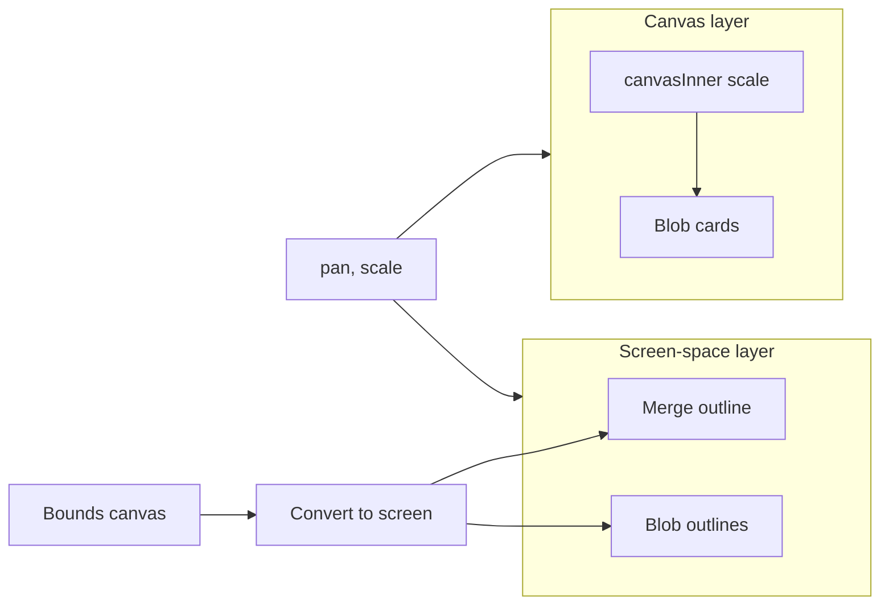

# Screen space vs canvas space — dedicated layer (B)

## Concepts

- **Canvas space:** World coordinates used by the scaled canvas (`canvasInner`). Blob positions/sizes are in canvas units. The canvas has `transform: translate(pan) scale(scale)`.
- **Screen space:** Pixels in the canvas viewport (same origin as the canvas container). Formula: `screenX = pan.x + canvasX * scale`, `screenW = canvasW * scale`. All "12px", "80px", "2px" invariants are in this space.

## Architecture

- **Canvas layer (unchanged):** [app/page.tsx](app/page.tsx) — `canvasInner` with pan/scale; blob cards and content stay here. No scale on border/outline logic; those move to screen layer.
- **Screen-space overlay:** New layer that sits over the canvas (same size, `position: absolute`, no scale transform). Used for: merge outline, blob outlines. `pointer-events: none` so hit-testing stays on the canvas.
- **Conversion:** Central helpers so all screen-invariant logic uses one place for canvas → screen (and screen → canvas if needed).

## Implementation

### 1. Canvas ↔ screen conversion

- Add a small module (e.g. [lib/canvas-screen-space.ts](lib/canvas-screen-space.ts)) with:
  - `boundsCanvasToScreen(bounds: BlobBounds, pan: { x, y }, scale: number): BlobBounds` (or a `Rect` type with left, top, width, height).
  - Optionally `pointCanvasToScreen` / `pointScreenToCanvas` if needed later.
- Reuse [lib/blob-constants.ts](lib/blob-constants.ts) `BlobBounds` (or a shared rect type) so call sites stay typed.

### 2. Screen-space overlay container

- In [app/page.tsx](app/page.tsx), inside the same parent as the canvas (the `div` with `ref={canvasRef}`), add a sibling overlay div that:
  - Covers the canvas (e.g. `position: absolute`, inset 0 within a wrapper, or same dimensions as canvas).
- Ensure the canvas parent has `position: relative` so the overlay stacks above the canvas. Overlay gets a class (e.g. `screenSpaceOverlay` in [app/page.module.css](app/page.module.css)), `pointer-events: none`, and `aria-hidden`.
- Pass `pan`, `scale`, and canvas size (from existing `canvasSize` or ref) into the overlay so it can work in screen coordinates (0 to width, 0 to height = canvas viewport).

### 3. Merge proximity in screen space

- In [app/page.tsx](app/page.tsx), the `useMemo` that computes `closeTargetId`, `veryCloseTargetId`, `mergeGap`, `mergeBoundsA`, `mergeBoundsB` currently uses [lib/blob-boundary-path.ts](lib/blob-boundary-path.ts) `gapBetweenRects` on **canvas** bounds.
- Change to:
  - Convert each blob's bounds to screen with the new helper (using current `pan` and `scale`).
  - Run `gapBetweenRects` on the **screen** bounds.
  - Keep `CLOSE_THRESHOLD = 80` and `VERY_CLOSE_THRESHOLD = 24` as **screen pixels**; compare `gapScreen < 80` and `gapScreen < 24`.
- Continue to pass canvas-space `mergeBoundsA`/`mergeBoundsB` (and `measuredMergeBounds` if still used) only where needed for **rendering** in the screen layer (they will be converted to screen there). Alternatively, compute screen bounds once and pass those into the overlay and use canvas bounds only for data that still lives in canvas (e.g. measuredMergeBounds can stay in canvas space and be converted at render time).

### 4. Merge outline in screen-space layer

- **Remove** [BlobBoundaryOverlay](components/BlobBoundaryOverlay.tsx) from inside `canvasInner`.
- Render it inside the new **screen-space overlay**, with inputs in **screen space**:
  - Parent (page) converts the two merge blob bounds to screen (using `boundsCanvasToScreen`) and passes screen rects plus `isVeryClose` and optionally `gap` (for any future use).
- In BlobBoundaryOverlay:
  - Treat all inputs as screen-space (left, top, width, height in pixels).
  - Merge cue = expand each rect by **12px** in screen space (no scale). Use a constant e.g. `MERGE_CUE_PADDING_SCREEN_PX = 12`.
  - Fuse when `gapBetweenRects(cueA, cueB) < 12` (screen pixels). Draw the same fused/separate paths as today but in pixel coordinates.
  - Stroke: **2px** (or 2.5 when very close); no scaling. SVG in this overlay is not inside a scaled transform, so `strokeWidth={2}` stays 2 screen pixels.
- Extending rects to include the controls column: do the "extend left" in **screen space** by extending the screen rect left by `SHOW_ALL_CONTROLS_LEFT_PX` (36px), instead of `SHOW_ALL_CONTROLS_LEFT_PX / scale` in canvas space.

### 5. Blob outline in screen-space layer

- Add a "blob outline" pass in the screen-space overlay: for each **visible** blob, compute screen rect (from blob position/size + pan/scale), then draw a 1px outline (e.g. SVG rect or div with border) in screen space.
- In [BlobCard.module.css](components/BlobCard.module.css), remove or zero the card's visual border (e.g. `border: 1px solid ...` on `.card`) so the only outline is the screen-space one. Keep hit-testing on the canvas (card still receives pointer events); the overlay has `pointer-events: none`. If selection ring (e.g. `box-shadow: 0 0 0 2px`) is on the card, either move that to the screen layer as well (2px ring per selected blob in screen space) or leave it and make the ring scale-dependent for now; plan recommends moving it to screen layer for consistency so selection ring is also 2px in screen space.

### 6. Dragger and "…" distance

- **Verify only:** Controls are portaled to [ControlsOverlayPortal](app/page.tsx) with the same transform as the canvas; each control column uses `left: -(SCREEN_GAP + CONTROLS_COLUMN_WIDTH) / scale` and `transform: scale(1/scale)` so the **gap** (8px) and **size** are already screen-invariant. No structural change; optionally add a short comment or constant that the 8px gap is intentional screen space. If any test or layout assumes canvas-space offset, keep behavior as-is.

### 7. Constants and boundaries

- Move or duplicate screen-space constants to a single place (e.g. [lib/blob-constants.ts](lib/blob-constants.ts) or the new screen-space lib): e.g. `MERGE_CUE_PADDING_SCREEN_PX = 12`, `CLOSE_THRESHOLD = 80`, `VERY_CLOSE_THRESHOLD = 24`, merge outline stroke 2/2.5, blob outline 1px. Use these in both merge logic and overlay rendering so zoom behavior stays consistent.

### 8. Preserve existing behavior

- Hit-testing: all pointer events remain on the canvas (blobs, resize handles, drag). Screen overlay is non-interactive.
- Measured merge bounds: if still used for layout or measurements, keep in canvas space and convert to screen only at the overlay render. No change to drag/merge interaction flow.
- [BlobBoundaryOverlay](components/BlobBoundaryOverlay.tsx) and [lib/blob-boundary-path.ts](lib/blob-boundary-path.ts): path math (rounded rects, fused path) stays the same; only the coordinate system of inputs and the place of rendering change. Remove or refactor any `MERGE_CUE_PADDING` usage in canvas space so padding is only applied in screen space in the overlay.

## File summary

| Area              | Files to add/modify                                                                                                                                                                        |
| ----------------- | ------------------------------------------------------------------------------------------------------------------------------------------------------------------------------------------ |
| Conversion        | New: `lib/canvas-screen-space.ts`. Use in page and overlay.                                                                                                                                |
| Overlay container | `app/page.tsx` (structure + pass pan/scale/size), `app/page.module.css` (overlay class).                                                                                                   |
| Merge proximity   | `app/page.tsx` useMemo: convert to screen, compare gap to 80/24 px.                                                                                                                        |
| Merge outline     | `components/BlobBoundaryOverlay.tsx`: accept screen rects, 12px padding, 2px stroke; render in screen overlay. `app/page.tsx`: convert merge rects to screen, render overlay in new layer. |
| Blob outline      | New component or block in overlay: blob screen rects → 1px outline. `BlobCard.module.css`: remove card border (and optionally move selection ring to overlay).                             |
| Constants         | `lib/blob-constants.ts` or screen-space module: screen-pixel constants.                                                                                                                    |

## Testing and verification

- Manually: zoom in/out and confirm (1) merge outline stays 12px from blob and stroke ~2px, (2) blob outline stays ~1px, (3) "close"/"very close" merge state triggers at consistent screen distances, (4) dragger/"…" gap and size unchanged.
- Existing tests: ensure no reliance on canvas-space pixel values for these UI elements; update any assertions that depend on old merge or outline behavior.
